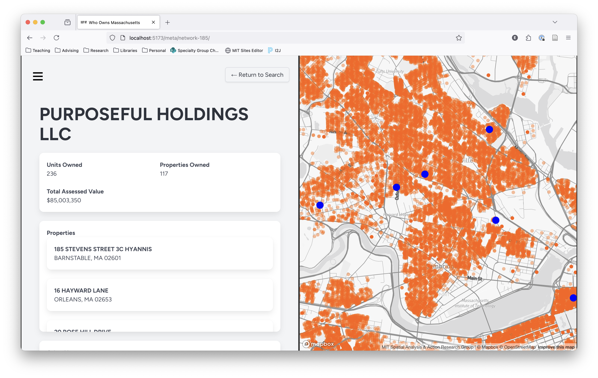

# Who Owns Massachusetts Frontend

[](https://app.netlify.com/sites/who-owns-mass-frontend/deploys)



This is the codebase for the front end of the Who Owns Massachusetts application. It's built using Svelte and SvelteKit and draws on the Bulma CSS/SCSS framework. Both production and staging branches available at...

+ [Production](https://who-owns-mass-frontend.netlify.app/): Builds from [`main`](https://github.com/mit-spatial-action/who-owns-mass-frontend/tree/main) branch.
+ [Staging](https://staging--who-owns-mass-frontend.netlify.app/): Builds from [`staging`](https://github.com/mit-spatial-action/who-owns-mass-frontend/tree/staging) branch.

## Configuration

### Node

Assuming you have `node` installed, you can install all dependencies by running `npm install` from the root directory.

### .env Configuration

The application expects several environment variables in an `.env` file located in the project's root directory. These are...

```
PUBLIC_MAPBOX_TOKEN='your token here`
VITE_PUBLIC_API_URL='http://djangoserverhost'
```

Note that your Mapbox token will be exposed to the client! As such, before deploying, you should make sure that your token is appropriately scoped and that it has URL restrictions in place. 

## Running

Run `npm run dev` from the root folder. This starts a vite server (`vite dev`) and a sass watcher that watches for changes in `src/styles/style.scss.`
